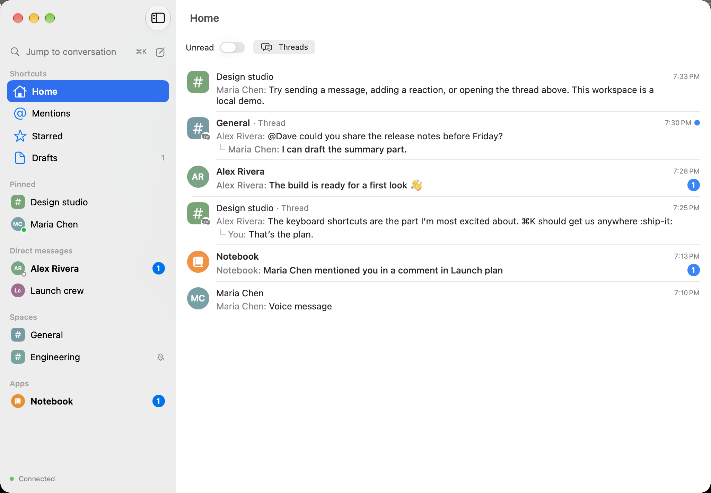
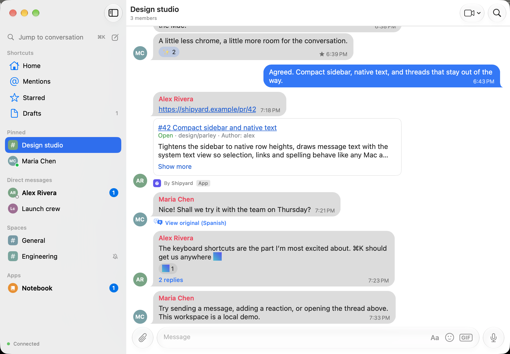
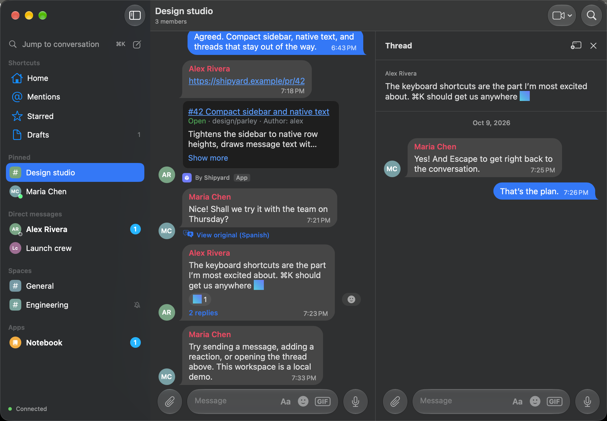
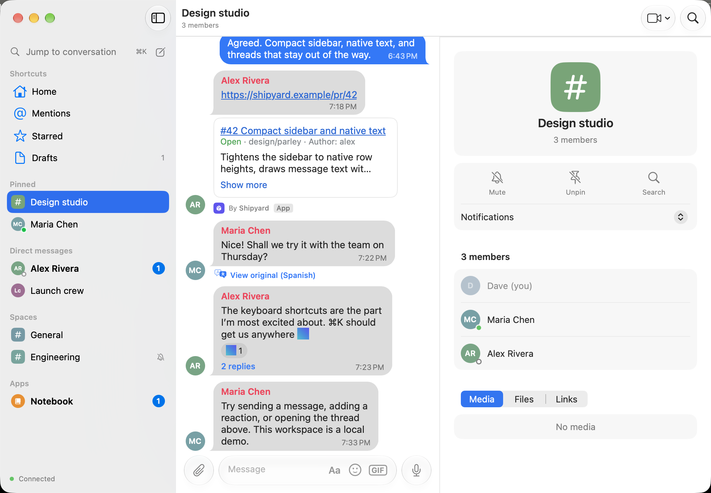
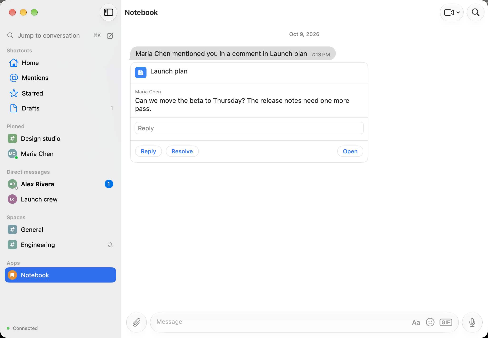

# Parley

A native macOS client for Google Chat, written in Swift with SwiftUI and AppKit.

Parley is an unofficial, independent project. It is not affiliated with or endorsed by Google. It uses the same private web API as Google Chat's web app, signed in with your own session. It stops working if Google changes that API. Use it with your own account.

An LLM wrote most of the code. It was vibe-coded and tested in daily use, not designed and reviewed line by line. Expect rough edges, and read the code before relying on it.



| A conversation | Threads in a side pane, in dark mode |
|---|---|
|  |  |
| **The conversation info panel** | **An app's card, with Reply and Resolve in the card** |
|  |  |

## Features

- **Home and shortcuts.** Home lists recent conversations and followed threads, filtered by unread or threads. Mentions, Starred and Drafts each have their own list, and drafts sync with Google Chat.
- **Conversations.** The sidebar groups DMs, group DMs, spaces and app DMs under Pinned, Direct messages, Spaces and Apps. Pin, mute, mark as unread and leave sync with Google Chat.
- **Timeline.** Messages show as bubbles or a plain list, with formatting, reactions, read receipts, images, GIFs, files and link previews. Threads open in a side pane. A trackpad swipe on a message quotes it, and a longer swipe opens its thread. System events show as service lines.
- **Cards.** Google Drive files show a preview of their first page. Any Chat app's cards show under its messages: link previews from apps, with "By <app>" under them; Drive comment cards, whose Reply and Resolve act in the card; and "Only visible to you" app suggestions and setup prompts. Meet calls show as call chips.
- **Composer.** It has @-mentions, emoji and GIF search (GIPHY). Attach files from a picker, by pasting or by dragging them in.
- **Formatting.** Bold, italic, underline, strikethrough, text colour, code, code blocks, quotes, lists and links, from the Aa bar, the right-click Format menu or shortcuts: ⌘B, ⌘I, ⌘U, ⇧⌘X strikethrough, ⇧⌘C code, ⌥⇧⌘C code block, ⇧⌘I quote, ⇧⌘8 list, and ⌘K for a link.
- **Space chips.** Paste a link to a space and press Tab to turn it into a chip.
- **Calls.** Send a Meet link from the camera button or File ▸ Send a Meet Link (⇧⌘M). Incoming calls notify with Join and Decline.
- **Translations.** With Google Chat's Automatic Translation on, translated messages show the translation, and View original shows what was written.
- **Emoji.** Custom emoji show as pictures, emoji-only messages show large, and hovering an emoji or reaction shows a card with it.
- **Ask Gemini.** Answers show their sources and Show thinking.
- **Realtime.** New messages, edits, reactions, typing, presence and conversation changes arrive as they happen.
- **Notifications.** Each conversation follows its Google Chat notification level (All new messages, Main conversations, For you, Don't notify) and mute setting.
- **Search and info.** Search messages, or open a conversation's info panel for its members and shared media, files and links.

## Native to the Mac

- **Notifications.** macOS groups the banners by conversation, and each has a Reply field. Focus and Do Not Disturb apply as they do to any Mac app.
- **Dock badge.** The app icon shows the unread count.
- **Windows.** Any conversation or thread can open in a window of its own. Opening a side pane widens the window only by the pane's width. The sidebar hides when the window is too narrow for it, and View ▸ Show Sidebar (⌃⌘S) brings it back.
- **Looks.** Light, dark or Auto. Wallpapers with optional doodles, and your bubble colour, set for each appearance. Messages show as bubbles or a plain list.
- **Notification sounds.** Default follows macOS; you can pick any Mac sound, or None.
- **Updates.** Parley updates itself; Parley ▸ Check for Updates… checks now.
- **Text.** The composer is a native macOS text view, with spell checking and autocorrection.
- **Files.** Press Space for Quick Look on an attachment, or drag it out to Finder. Drag or paste files and images into the composer.
- **Voice messages.** Record and play them in the app.
- **Keyboard.** The shortcuts are:
  - ⌘K jumps to a conversation, person or space; in the composer it adds a link.
  - ⌘E edits your last message.
  - ⌘N starts a new chat.
  - ⌘1…9 and ⌥↑/⌥↓ move between conversations, and ⌘[ and ⌘] go back and forward, as do a mouse's side buttons.
  - ⇧⌘F searches messages.
  - ⌘I opens the info panel, and Esc closes it.
- **Sign-in.** You sign in inside the app. The Keychain holds the session, and the app renews it in the background.

## Requirements

- macOS 15 or later
- Xcode 27 with Swift 6
- [XcodeGen](https://github.com/yonaskolb/XcodeGen) to generate the Xcode project from `project.yml`
- A Google account with Google Chat

## Building

1. Clone the repository.
2. In `project.yml`, set `DEVELOPMENT_TEAM` to your own Apple Developer team ID. It is the only place the team appears.
3. Generate the project and open it:
   ```sh
   xcodegen generate
   open Parley.xcodeproj
   ```
4. Build and run the `Parley` scheme.

Swift Package Manager resolves the dependencies, [SwiftProtobuf](https://github.com/apple/swift-protobuf) and [Sparkle](https://github.com/sparkle-project/Sparkle).

### Signing in

On first launch Parley shows a welcome screen. **Sign in with Google** opens an in-app Google sign-in window with its own website data, separate from your browsers. Once Google has signed you in to Google Chat, Parley checks the session, keeps it in your Keychain and closes the window. Passkeys aren't available in the window; choose **Try another way** at that step.

Parley keeps your session only in the macOS Keychain. Signing out from Settings › Account also clears the sign-in window's data.

### Optional

- **GIF search.** Add your own GIPHY API key in Settings. The app keeps it in the Keychain.
- **Sharing a build.** A build signed with an Apple Development certificate runs only on your own Macs. To give the app to other people, archive it with a Developer ID certificate and notarize it with Apple. The project already enables the hardened runtime that notarization requires.

## Tests

```sh
xcodebuild test -project Parley.xcodeproj -scheme Parley -only-testing:ParleyTests -destination 'platform=macOS'
```

Unit tests use Swift Testing and run against a fake backend with stubbed network requests, so they never reach Google. UI tests (`ParleyUITests`) launch the app with the fake backend through launch arguments such as `-uiTestingLongHistory`, `-uiTestingManyConversations` and `-uiTestingFormattedThread`.

## Project layout

| Path | Contents |
|---|---|
| `Parley/App` | App entry point and scenes |
| `Parley/Domain` | Models and the `ChatBackend` protocol |
| `Parley/Dynamite` | The Google Chat API client: requests, realtime channel, mapping, sign-in |
| `Parley/Store` | `ChatStore`, notifications, sign-in flow, diagnostics |
| `Parley/UI` | SwiftUI views and the AppKit timeline |
| `Parley/Preview` | `FakeBackend`, used by previews and tests |
| `Proto` | The protobuf schema; regenerate the Swift code with `protoc --proto_path=Proto --swift_out=Parley/Dynamite/Proto Proto/dynamite.proto` |
| `ParleyTests`, `ParleyUITests` | Unit and UI tests |

## Acknowledgments

- [SwiftProtobuf](https://github.com/apple/swift-protobuf) (Apache License 2.0), the protobuf runtime and code generator.
- [XcodeGen](https://github.com/yonaskolb/XcodeGen) (MIT License), which generates the Xcode project.
- [Sparkle](https://github.com/sparkle-project/Sparkle) (MIT License), which updates the app.
- [purple-googlechat](https://github.com/EionRobb/purple-googlechat) (GPL-3.0) and [mautrix-googlechat](https://github.com/mautrix/googlechat) (AGPL-3.0), open-source Google Chat clients consulted as references for request and message formats.
- [Telegram for macOS](https://github.com/overtake/TelegramSwift), which inspired the timeline's design and swipe to reply.
- GIF search is [Powered by GIPHY](https://developers.giphy.com).

## License

Parley is released under the MIT License; see [LICENSE](LICENSE).
